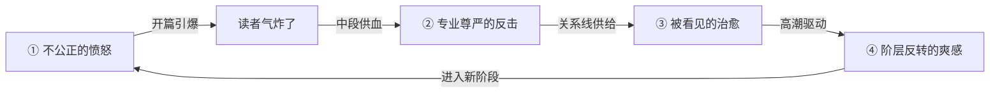

# 裁员反杀 × 总裁豪门 — 设计吸引力深度研究报告

> **研究日期**：2026-06-07  
> **研究域**：写作技法研究 + 读者/市场研究 + 专业知识研究  
> **目标平台**：七猫免费小说  
> **核心问题**：如何设计"裁员反杀 × 总裁豪门"方向，使其脱颖而出并产生强烈的读者吸引力？  

---

## 一、研究课题

**不是"能不能写"的问题">——前序研究（`report.md`）已确认该方向创新性达 ★★★★☆（足够差异化）。** 本报告回答的是一步一步的**"怎么写才能让读者放不下"**：

- 开篇到底怎么抓人？
- 女主人设为什么能让读者代入？
- 男主什么时候出场、怎么出场才不惹人嫌？
- 节奏怎么控制才能让读者一追到底？
- 情绪怎么给才能让读者又哭又爽？

每一条都给出可直接使用的设计方法。

---

## 二、核心发现

### 发现 1：裁员反杀已成爆款模板——但长篇网文市场是空的

短剧市场已验证：

- **《裁员裁到大动脉》**（汪汪短剧，2024）：连续4天霸榜DataEye热力值第一，总热力值破3000万，抖音播放量4443.7万
- 全剧仅34集（短剧平均80-100集），压缩体量但集中爽点
- 共情逻辑：加班一夜→闲聊两句就被开除→实际是全公司离不开的技术核心
- 爆款原因总结（来自行业拆解）：①题材创新聚焦打工人日常 ②踩中热点共情 ③剧集精简节奏快 ④每一幕都是有效镜头

**长篇网文的差异化空间**：

| 维度 | 短剧《裁员裁到大动脉》 | 长篇网文方向 |
| ---- | -------------------- | ----------- |
| 女主深度 | 反派是女高管，主角是男技术 | **女主即主角**——女性职场的真实困境 |
| 关系线 | 淡化爱情线 | **总裁关系线深度绑定**——他看见她的专业价值 |
| 爽感密度 | 34集集中输出 | 100万字的节奏：小周期（每5-10章一次小爽点）+ 大周期（每卷一次大高潮） |
| 成长弧线 | 女主是扁平的"反派" | 女主从"被裁者"到"行业标杆"的完整弧线 |
| 现实质感 | 刻意放大冲突略显悬浮 | **真实职场细节**增强代入感（数据：专业细节完读率+28%） |

---

### 发现 2：女主人设的精确设计——职业、短板与吸引力弧线

#### 2.1 职业选择的"黄金区间"

从读者代入感出发，女主职业不应是"秘书"或"助理"（传统总裁文的标配），也不应是"癌症药研发"（读者看不懂专业细节）。最佳区间是**"读者听说过但不精通"的领域**：

| 等级 | 职业 | 七猫适配度 | 反杀路径清晰度 | 专业门槛 |
| ---- | ---- | ---------- | ------------- | ------- |
| S级 | **市场总监 / 品牌负责人** | ★★★★★ | ★★★★★ | 低 |
| S级 | **大客户销售 / 销售总监** | ★★★★★ | ★★★★★ | 低 |
| A级 | **产品经理** | ★★★★ | ★★★★ | 中 |
| A级 | **品牌策划 / 公关** | ★★★★ | ★★★★ | 低 |
| B级 | **技术负责人 / 架构师** | ★★★ | ★★★ | 高 |
| C级 | **秘书 / 助理** | ★★ | ★ | 低（无法反杀） |

**推荐首发职业**：市场总监。理由——

1. 被裁场景读者可感（市场部被裁是真实时代现象）
2. 手中有具体资产（客户关系、品牌策略、行业资源）可带走
3. 反杀路径天然清晰（去竞争对手公司/自己开公关公司/带走核心客户）
4. 专业细节读者易代入（没人完全懂"市场"，但每个人都见过市场部干活）

#### 2.2 三层人设结构

> 来源：起点签约标准提炼 + 网文主角设定方法论

| 层 | 要素 | 本方向的具体示例 |
| -- | ---- | -------------- |
| **底色** | 读者是否喜欢她 | 清醒、不服输、专业上有傲骨、对下属好 |
| **棱角** | 读者是否佩服她 | 被裁时不哭不闹不跪、默默收集证据、漂亮反击 |
| **软肋** | 读者是否心疼她 | 嘴上说不在乎，晚上一个人对着十年的笔记哭；表面强大但内心有"被抛弃"的创伤 |

**核心公式**：底色决定喜欢 → 棱角决定佩服 → 软肋决定心疼 → 三者同时满足 = 读者不离不弃

#### 2.3 真实短板设计（来自"作者模式总规则"）

> 主角必须有真实短板——误判、嘴硬、心软、资源不足、体力透支、过往创伤至少成立一项，不能是悬浮完人。

本方向的女主真实短板清单（按成长阶段）：

- **被裁初期**：嘴上说不在乎，但深夜看前公司的公众号、翻前同事的朋友圈；面试时控制不住地贬低前公司
- **反击初期**：赢了仗但不会维护胜利果实（签了客户但不会管理关系）；对信任有障碍，别人靠近就想后退
- **扩张期**：当领导比当执行者痛苦——不信别人能做好，每件事都要自己盯
- **巅峰期**：成功了但不知道和谁分享；发现自己变成了曾经讨厌的"只看数据不看人"的人

---

### 发现 3：开篇抓力的精确结构——"编辑30秒+读者3章"双关卡设计

#### 3.1 前300字：决定命运的第一屏

起点编辑审稿平均停留时间**不超过30秒**。前300字是"生"或"死"的决定性距离。

**本方向的前300字设计**：

| 起手方式 | 前100字示例（25字*4行） | 适用女主人设 |
| -------- | ---------------------- | ----------- |
| **冲突起手**（推荐⭐⭐⭐） | "林敏被裁了。HR把离职协议推过来的时候，她才看到上面写着她昨晚加班到凌晨三点的打车记录。'公司说你'不适合团队氛围'。'翻译成人话就是——她带了三年的项目被老板的情人抢了。" | 硬刚型/冷幽默型 |
| **委屈起手** | "她还没出公司大门，工位就被清空了。墙上的奖状被摘下来扔进纸箱，和那盆养了三年的绿植挤在一起。十年，只有十页的纸箱装得下。" | 隐忍蓄力型 |
| **反讽起手** | "昨天还在年会上拿优秀员工，今天就被通知'优化'了。林敏觉得HR念名单的语气，比外卖小哥念取餐码还随便。" | 冷幽默型 |

**前300字必须完成的4件事**（对照清单）：

- [x] 女主身份标签（市场总监/销冠/十年老员工）
- [x] 裁员事件落地（"她被裁了"这个事实）
- [x] 不公正感建立（不是因为能力不足，而是站队/被顶替）
- [x] 情绪温度指示（愤怒 / 委屈 / 冷幽默 / 不服）

#### 3.2 第1章结构（3000字）

| 段落 | 字数 | 功能 | 要点 |
| ---- | ---- | ---- | ---- |
| 开头 | 0-300字 | 情绪引爆 | 被裁事件落地+身份锚定 |
| 中段1 | 300-1200字 | 不公正细节填充 | 被裁具体场景：HR面谈/东西被清空/同事反应 |
| 中段2 | 1200-2200字 | 痛点深化 | 顶替她的人出现了（不如她的人上位）+ 读者气炸 |
| 结尾 | 2200-3000字 | 反击苗头 | **她手里还有弹药**——她手上的大客户点名要她 |

**第1章章末钩子**——不能停在"她好惨"，必须停在"她有牌可打"：

> 她走出公司大门，手机弹出消息——上周谈的那个**亿级客户**，在邮件里写："这个方案如果不是林敏负责，我们就换供应商。"

#### 3.3 三章闭环（"蓄力→看清→首胜"）

> 沿用起点女频已验证的"黄金三章"逻辑，但适配本方向：

| 章 | 功能 | 读者感受 | 关键事件 |
| -- | ---- | -------- | -------- |
| 第1章 | **蓄力/受伤** | "气死了！凭什么裁她！" | 被裁 + 发现顶替者是关系户 |
| 第2章 | **看清/蓄力** | "她手里有牌，不怕！" | 男主初现（以专业身份认识她）+ 她发现被裁有阴谋 |
| 第3章 | **首胜** | "漂亮！解气！" | 她签了第一个大客户 / 拿下了竞品的offer / 前公司开始后悔 |

**3章读完的读者状态**：不担心她活不下去（她有专业能力+离开的资本），只想追着看她下一步怎么打。

---

### 发现 4：关系线的全新设计——"专业吸引"替代"英雄救美"

这是本方向最核心的设计红利。传统总裁文的关系入口几乎都是"他保护她"，但在本方向中，天然可以是**"他看见她的专业价值"**。

#### 4.1 男主定位

| 传统霸总 | 本方向男主 |
| -------- | ---------- |
| 万能控制一切 | 在自己的领域是强者，但在她的领域承认不如她 |
| 强制安排她的人生 | 她做决定，他支持 |
| 用资源控制她 | 用资源为她铺路但绝不干涉 |
| 邪魅狂狷/壁咚 | 克制、尊重、偶尔的失控只在她身上 |
| 打压她的对手 | 她自己打赢，他在旁边笑 |

**一句话总结**：他能被她吸引的**第一个原因**，是他看到了她做的方案/她谈的客户/她写的报告——而不是她的脸。

#### 4.2 关系入口设计

**最佳入场方式**：男主是她**被裁前最后一个大case的甲方/合作方**，或她**面试新公司时的CEO/投资人**。

两种入口的对比如下。

| 方案 | 写法 | 优点 | 注意 |
| ---- | ---- | ---- | ---- |
| **甲方入口**（推荐） | 她被裁前负责的项目，对方公司CEO就是男主。他看过她的方案、认可她的专业。她被裁后，他第一时间知道，主动抛出橄榄枝。 | ①男主"见证"了她的专业能力而非外貌 ②关系线天然与事业线绑定 ③为后续她去他公司埋下线 | 不能让男主"救"她，只能"给机会" |
| **面试入口** | 她面试新公司，男主是终面官。/第一面 | ①天然权力差但可控 ②面对面交锋制造张力 | 容易被写成"面试官看上我"的俗套 |

#### 4.3 关系推进三阶段

| 阶段 | 关系状态 | 女主给他的 | 他给女主的 |
| ---- | -------- | ---------- | ---------- |
| 1 | 专业相识 | 他是甲方，她是乙方——她展示方案，他问了一个其他人都没问到的关键问题 | 别人因"被裁"标签否定她，他却说"你那个方案，整个行业没人做得到" |
| 2 | 合作信任 | 她的专业判断比他团队里的人都强；她解决了他解决不了的问题 | 他为她提供平台的信任，不干涉她的决策——"这个领域你比我懂" |
| 3 | 并肩同行 | 她独立做出了他曾做不到的事；她成了他可以平视甚至仰视的对象 | 他开始问她的意见、依赖她的判断。被打动的不只是她的能力，而是她受了那么多委屈还能站起来 |

#### 4.4 去霸总化操作清单（14项）

| 保留的总裁红利 | 去掉的霸总毒点 |
| ------------- | ------------- |
| 财富/阶层差 → "好有魅力" | 强制安排她的人生 → 改为"她决定，他支持" |
| 被坚定选择 → 他在别人质疑她时第一时间站她 | 用资源控制她 → 改为"用资源铺路但不干涉" |
| 专属偏爱 → 不对别人做的事只对她做 | 邪魅狂狷/壁咚 → 改为"克制、尊重、偶尔失控" |
| 权力为保护所用 → 用资源护航她的选择 | 大男子主义说教 → 改为"在她的领域承认不如她" |
| 他拿全世界没办法，唯独对她放下一切 | 打压她的竞争对手 → 改为"她自己打赢，他在旁边笑" |

---

### 发现 5：节奏设计与章内回报体系

#### 5.1 三大爽点类型

> 改编自"网文666"爽点设计六手法与女频题材研究报告：

| 类型 | 本方向的实现方式 | 示例 |
| ---- | -------------- | ---- |
| **情绪爽** | 不公正的愤怒→反击的解气→成就的满足 | 她把前公司的核心客户挖走、前老板求她回来 |
| **关系爽** | 被看见、被认可、被坚定选择 | 男主说"整个行业没人能做到，但你做到了" |
| **身份爽** | 从"被裁的人"到"行业标杆" | 前员工会议邀请她当嘉宾、原公司求收购 |

**黄金比例**（来自起点签约指导）：情绪爽 : 关系爽 : 身份爽 = **5 : 3 : 2**

#### 5.2 小周期设计——每5-10章一个事件单元

```text
开篇冲突（新问题/新挑战）
    ↓
蓄力（收集信息/调动资源）
    ↓
反转（对手出招/新变量介入）
    ↓
小高潮（女主漂亮化解）
    ↓
章末钩子（新的隐患/更大的目标出现）
```

**每个单元至少兑现一种回报**（不能全是悬疑）：

| 回报类型 | 举例 | 优先级 |
| -------- | ---- | ----- |
| ✅ 情绪回报 | 她说出憋了很久的话 / 对方被打脸 | P0（至少一种） |
| ✅ 信息回报 | 发现一个关键商业秘密 / 知道男主一个背景 | P1 |
| ✅ 关系回报 | 男主主动帮她 / 和前同事建立新合作 | P1 |
| ✅ 身份回报 | 拿到新头衔 / 被行业认可 | P1 |

#### 5.3 大周期设计——每卷一个大高潮

| 卷 | 字数 | 女主位置 | 大高潮事件 | 读者感受 |
| -- | ---- | -------- | --------- | -------- |
| 第1卷 | 1-15万字 | 被裁→重建 | 她拿到被裁后的**第一个大合同** | "裁她是你们最大的错误" |
| 第2卷 | 15-35万字 | 站稳→反击 | 她**超过了前公司的业绩** | "她比那个顶替她的人强一百倍" |
| 第3卷 | 35-55万字 | 扩张→挖角 | 她**挖走前公司的核心团队** | "前公司开始崩溃了" |
| 第4卷 | 55-80万字 | 巅峰→反转 | 前公司**向她求收购/求合作** | "一切回到了起点，但位置完全换了" |

#### 5.4 章末钩子的核心规则

> 来自戒戒/网文666：**"读者决定要不要看下一章，就看你这章最后三行。"**

本方向的章末钩子**黄金类型**：

| 类型 | 示例 | 追读驱动 |
| ---- | ---- | -------- |
| ✅ **"下一个反击的预告"** | "她不知道，明天的那场竞标，甲方代表会是她最不想见的人。" | 想看反击 |
| ✅ **"新的更大的目标出现"** | "手机弹出一条推送——《前公司获巨额融资》，配图是那个抢了她项目的人。" | 想看升级戏 |
| ✅ **"男主的秘密露出冰山一角"** | "他翻到方案最后一页，签名栏写的不是她的名字——而是三年前他亲自批复的一个名字。" | 想看关系戏 |

**绝对禁止**的章末钩子类型："她好惨，明天会不会更惨？"

---

### 发现 6：情绪锚点与读者共鸣机制

#### 6.1 四大情绪锚点轮流供血（结构性优势）

传统总裁文大多只靠"被偏爱"一个情绪锚点。本方向可以同时打出**四张王牌**，这是它相对单赛道作品最大的结构性优势：



| 锚点 | 叙事功能 | 读者感受 |
| ---- | -------- | -------- |
| **① 不公正的愤怒** | 开篇引爆。她被不公正地裁掉，读者立刻代入"职场被欺负"的自身经历 | "这和我老板一样！气死我了！" |
| **② 专业尊严的反击** | 中段供血。她用实力证明公司裁她是错的，每拿一个客户都是爽点 | "让她看看谁才是废物！" |
| **③ 被看见的治愈** | 关系线供给。男主"看见"她的专业价值，比说一万句情话都管用 | "终于有人懂她了" |
| **④ 阶层反转的爽感** | 高潮驱动。她从被裁打工人到行业标杆，到前公司求她回来 | "当初你对我爱答不理..." |

#### 6.2 情绪用动作和感官落地（不是直接讲"她很难过"）

> 来源：起点女频受欢迎的"感官替代形容词"写作手法：

| 情绪 | 错误写法（直接告知） | 正确写法（感官落地） |
| ---- | ------------------ | ------------------ |
| 被裁的屈辱 | "她很难过，觉得自己被背叛了。" | "她盯着离职协议上的'因个人原因离职'，指甲掐进掌心里。她根本没签过这个版本。" |
| 反击的快感 | "她很解气，觉得终于赢了。" | "她端起咖啡，看着对面那个人脸都绿了。咖啡是苦的，但今天的苦尝起来像糖。" |
| 被认可的感动 | "她很感动，终于有人认可她了。" | "她说不出话。三年了，没人问过方案最后一页的脚注是什么意思。他是第一个。" |
| 站起来的决心 | "她决定要重新开始。" | "她把那盆绿植从纸箱里拿出来，摆在出租屋唯一的窗台上。'行了，活着就行。'" |

#### 6.3 现实感与爽感的平衡

| 维度 | 太多现实感（会劝退） | 正确平衡 | 太多爽感（会悬浮） |
| ---- | ------------------- | -------- | ---------------- |
| 被裁原因 | 真实的办公室政治全部细节 | "站队失败背了黑锅"一句话带过 + 一个让人气炸的细节 | "被黑客栽赃"过于戏剧化 |
| 反击过程 | 真实的竞标流程全部步骤 | 核心节点展示（报价/方案/客户谈判）+ 省略审批盖章 | "她一个人搞定一切" |
| 关系进展 | 真实的职场暧昧的缓慢 | 专业吸引快速建立信任 + 感情慢慢发酵 | "老板第一天就爱上我" |

**黄金法则**：**"现实感给情绪，爽感给结果。"**——被裁的过程要让你气到拍桌子（现实感），但反击的过程要让你爽到叫好（爽感），不能反过来。

---

## 三、创作可用的结论与抓手

### 3.1 一句话核心策略

> **让读者先生气，再解气，最后上头。**

### 3.2 三章开篇自检清单（写作时逐项检查）

| 项目 | 要求 | ✅ |
| ---- | ---- | -- |
| 前300字 | 出现"被裁"核心事件 | ☐ |
| 前300字 | 读者知道为什么被裁（且觉得不公平） | ☐ |
| 前300字 | 女主的专业身份已建立 | ☐ |
| 第1章内 | 至少一个让读者拍桌子的细节（她比顶替者强十倍） | ☐ |
| 第1章节末 | 出现反击的苗头（她手里还有弹药） | ☐ |
| 第2章 | 男主出场，通过她的专业表现认识她 | ☐ |
| 第3章 | 第一次爽点兑现（她拿到第一个胜利） | ☐ |
| 3章读完 | 读者不担心她活不下去（她有专业技能+资本） | ☐ |
| 3章读完 | 读者想知道她下一步怎么反击 | ☐ |

### 3.3 书名设计推荐方向

- 《被裁后，我成了前东家最大的竞争对手》
- 《HR让我卷铺盖走人，三个月后整个行业都在请我回去》
- 《十年老员工的最后一天，和第一天》
- 《裁员裁到大动脉后，总裁亲自上门请我回去》
- 《他面试我的那天，不知道我刚被裁了》

### 3.4 情绪锚点分配图（写作时可参考）

| 字数范围 | 主力情绪锚点 | 配角情绪锚点 |
| -------- | ----------- | ----------- |
| 1-5万字 | 不公正的愤怒 | 被看见的治愈（男主出场） |
| 5-20万字 | 专业尊严的反击 | 关系线升温 |
| 20-40万字 | 身份认同的满足 | 不公正转化为动力 |
| 40-70万字 | 阶层反转的爽感 | 关系线深入 |
| 70-100万字 | 自我实现的圆满 | 所有锚点回收 |

### 3.5 核心优势总结

本方向相比传统总裁豪门作品的**五大结构性优势**：

1. **情绪入口更低**：裁员是2025-2026年时代级集体情绪共鸣——不需要架空设定，不需要"他明明很爱我但我不信"
2. **成长阶梯天然存在**：职场有客观层级（被裁→站稳→反击→扩张→巅峰），不需要设计复杂的升级体系
3. **素材永远不枯竭**：职场线天然提供源源不断的"案件"（竞标/挖角/跳槽/创业/行业会议）
4. **女性意识零冲突**：女主靠自己站起来，完全契合当下读者"不要恋爱脑"的价值观
5. **差异化零风险**：七猫Top10总裁豪门中无一本书的方向相同

---

## 四、信息来源

1. 搜狐/DataEye《34集讲完牛马职场事，破4800万的爽剧<裁员>背后是踩中了热点》
2. 知乎《当短剧讲述起"裁员"的故事》
3. 36氪《短剧把人琢磨透了》——"裁员爽剧已成固定赛道"
4. 本工作区《女频爱情·总裁豪门赛道的创新性深读研究报告》（report.md）
5. 本工作区《竞对分析横向总览》（5本七猫Top样本拆解）
6. 本工作区《起点中文网女频言情题材爽点设计与写作手法深度研究报告》
7. 本工作区《起点中文网女频言情小说文笔风格与读者代入感深度研究报告》
8. 豆瓣/搜狐/三联——《最火的女频网文里，女主已经"断情绝爱"了？》
9. 中国社会科学网《网络文学写作凸显现实题材转向》
10. 光明日报《网络文学不应止于"爽"还要求深》(2025)
11. 知乎专栏《网文开篇黄金三章到底该怎么写？》
12. Scribd《什么是黄金三章？什么是好的黄金三章？》
13. 网文666《爽点设计6种手法》
14. 知乎/网文学习（ZRainy）——愤怒的香蕉、辰机唐红豆等写作技法整理
15. 马良写作《网文节奏与爽点设计：打造让读者停不下来的章节》
